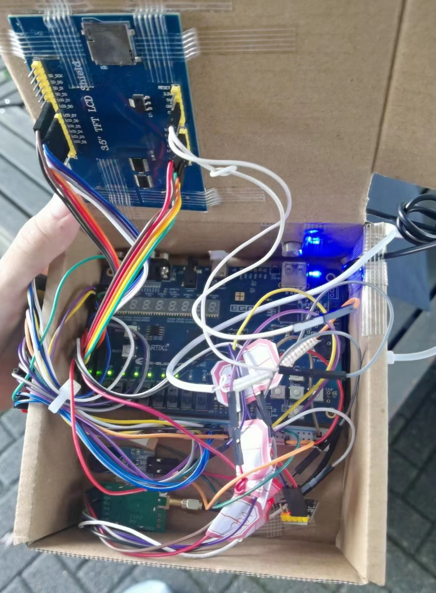

## 数字系统课程设计-基于FPGA的GPS自行车辅助终端

source/bicycle: 自行车端Verilog

source/mobile: 移动端Verilog

​	大一的时候做的课程设计，现在已经不玩FPGA了，这个仓库仅作为留念

​	主要使用FPGA实现了用户交互，图形界面渲染与显示，传感器交互。所有模块Verilog全部手写，没有调用任何IP核，实现了UART SPI IIC总线驱动，以及在串口之上实现了GPS NMEA协议解析和LORA无线模块通信。

图形界面：

Mobile端：

Bicycle端：

